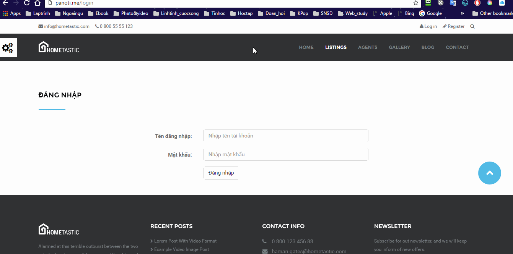

# Project UDPT - *BiNaManager*

**BiNaManager** Đây là trang web quản lý của khách sạn "BiNa Hotel" được viết bởi nhóm BiNa . Thời gian nộp: Theo Timeline của project.

* Danh sách sinh viên: 

* 1312379 Nguyễn Thị Bích Ngân
* 1212015 Phan Long Ánh
* 1212535 Bùi Thị Thanh Xuân
* 1212283 Phan Sông Núi

URL: http://panoti.me/
## Mô tả

Tin học hóa các quy trình nghiệp vụ quản lý diễn ra tại một khách sạn. 
Mục đích của hệ thống này là giảm tới mức tối thiểu các công việc thủ công để đảm bảo tính chính xác, tin cậy của công việc.

## Chức năng

Danh sách chức năng **cơ bản**:
* Phân hệ Admin:
* [x] Quản lý tài khoản người dùng.

* Phân hệ Quản lý: 
* [ ] Quản lí khách hàng.
* [ ] Quản lý nhân viên.
* [ ] Quản lí phòng. 
* [ ] Thống kê, báo cáo doanh thu kết thúc ca làm việc. 
* [ ] Thống kê, báo cáo doanh thu hàng tháng.
* [x] Quản lí hóa đơn (lập, tìm kiếm, xuất hóa đơn).

* Phân hệ khách hàng:
* [x] Đăng ký tài khoản.
* [x] Khôi phục mật khẩu. 
* [x] Đăng nhập/ Đăng xuất. 
* [x] Tìm kiếm phòng khách sạn theo ngày đến, ngày đi.
* [x] Đặt phòng. 
* [ ] Thanh toán. 

Danh sách chức năng **nâng cao**: 
* Phân hệ Admin:
* [ ] Quản lý tài khoản người dùng.

* Phân hệ Quản lý: 
* [ ] Đánh giá hiệu năng của khách sạn theo thời gian tháng, quý năm dựa vào báo cáo doanh thu.
* [ ] Thông qua hiệu năng của khách sạn để đưa ra các chương trình giảm giá phù hợp.

* Phân hệ khách hàng:
* [ ] Đăng nhập bằng tài khoản facebook hoặc tài khoản google.
* [ ] Nhắc nhở thời gian hết hạn thuê phòng.

* Danh sách chức năng **phụ** đã làm nhưng không được liệt kê ở trên:

## Các chuẩn đầu ra cần thực hiện: 

* Hoạt động nhóm:
* [ ] Git với Centralize Workflow. 
* [ ] Git theo Feature Branch Workflow. 
* [ ] Git theo Feature Branch Workflow có Pull Request. 
* [x] Git theo Gitflow Workflow. 

* Công nghệ:
* [ ] Giải thích được lựa chọn xử lý tại client & server. 
* [x] Giải thích lý do sử dụng AJAX. 
* [ ] Đưa ra được nhiều hướng xử lý và so sánh. 
* [ ] Đưa được nhiều loại trường hợp so sánh, lựa chọn công nghệ hay. 

* Thiết kế:
* [ ] Thiết kế theo table. 
* [x] Thiết kế với div. 
* [x] Thiết kế nâng cao với navigation, header, footer, sidebar. 
* [x] Hiệu ứng: hover, focus,...
* [x] Thiết kế hoàn chỉnh chạy trên nhiều trình duyệt. 
* [x] Icon, màu sắc. 
* [x] Thiết kế responsive. 

* Lập trình front-end:
* [x] Lập trình JS cơ bản. 
* [x] Lập trình JS thao tác DOM. Sử dụng sự kiện như hover, change, click, focus,...
* [x] Lập trình JS với animation
* [x] Sử dụng MVC và module
* [x] Sử dụng HTML 5 cơ bản: localstorage, session storage,... 
* [x] Áp dụng một số design pattern nâng cao. 
* [ ] Sử dụng HTML 5 nâng cao: File API. 
* [ ] Áp dụng các thư viện JS phổ biến như: Angular JS, React,... 

* Lập trình và kiến trúc web: 
* [x] Có làm và thao tác CSDL. 
* [x] Có làm với MVC. 
* [x] Tách xử lý logic ở model. 
* [ ] Sử dụng decorators để tách một số xử lý liên quan giao diện khỏi model. 
* [ ] Sử dụng thêm nhiều mẫu thiết kế presenter, decorators, strategy để phân chia rõ hơn trách nhiệm các lớp trong MVC. 

* AJAX: 
* [x] Có làm. 
* [ ] Lập trình AJAX với JSON. 
* [ ] Lập trình AJAX với các callback success, error. 
* [ ] Sử dụng một số design pattern để thiết kế lớp truy xuất API. 
* [ ] Lưu trữ thông tin chứng thực tự động. 
* [ ] Upload file với AJAX. 

* Web API: 
* [ ] Có làm. Dùng JSON hoặc XML
* [ ] Thiết kế API theo Restful hợp lý. 
* [ ] Xây dựng được các API lấy thông tin đơn giản. 
* [ ] Xây dựng API cho phép đăng thông tin như cập nhật, xóa,...
* [ ] Có chứng thực API. 
* [ ] Tải file lên qua API. 

* Bảo mật: 
* [ ] Người dùng không được phép vào các trang không có quyền. 
* [ ] Tổ chức phân quyền dưới dạng middleware. 
* [ ] Chống SQL Injection. 
* [ ] Bảo mật chứng thực API. 
* [ ] Hiểu và giải thích được cách chống SQL Injection và bảo mật API. 

* API bên ngoài: 
* [ ] Google map API. 
* [ ] Chứng thực dùng API như Facebook, Google, Github,...
* [ ] Thanh toán với Paypal API. 
* [ ] Sử dụng API để post, chia sẻ thông tin: Facebook Graph, Twitter, Ingtagram, ...
* [ ] Sử dụng nhiều API. 

* Sử dụng frameworks: 
* [x] jQuery. 
* [x] CSS framework: bootstrap, foundation,...
* [ ] Backend Framework: MEAN, Sails, Meteor. 
* [ ] Front-end Framework: Angular JS 1, Angular JS 2, Ember, Backbone, React,... 
* [ ] Front-end Framework: Angular JS 1, Angular JS 2, Ember, Backbone, React,...

##Chuẩn đầu ra của từng thành viên:
* 1312379 Nguyễn Thị Bích Ngân
* Chức năng thực hiện: 
* [x] Đăng ký tài khoản.
* [x] Đăng nhập/ Đăng xuất.
* [x] Quản lý tài khoản người dùng.
* [x] Khôi phục mật khẩu. 
* [x] Đặt phòng. 
* [x] Tìm kiếm phòng khách sạn theo ngày đến, ngày đi.

* Đánh giá:

Tiêu chí | Kết quả đạt được
-------- | ----------------
Hoạt động nhóm | Sử dụng Git theo Gitflow Workflow
Công nghệ | AJAX
Thiết kế | Thiết kế với div, thiết kế nâng cao với navigation, header, footer, sidebar, hiệu ứng: hover, focus,... thiết kế hoàn chỉnh chạy trên nhiều trình duyệt, Icon, màu sắc, thiết kế responsive. 
Lập trình front-end | Lập trình JS cơ bản, lập trình JS thao tác DOM. Sử dụng sự kiện như hover, change, click, focus,... Lập trình JS với animation. Sử dụng MVC và module. Sử dụng HTML 5 cơ bản: localstorage, session storage,... Áp dụng một số design pattern nâng cao. 
Lập trình và kiến trúc web | Có làm và thao tác CSDL. Có làm với MVC. Tách xử lý logic ở model. 
AJAX | Có làm. 
Web API | Không
Bảo mật | Không
API bên ngoài | Không 
Sử dụng frameworks | jQuery. CSS framework: bootstrap, foundation,...

* 1212015 Phan Long Ánh
* Chức năng thực hiện:

* Đánh giá:

Tiêu chí | Kết quả đạt được
---------| ----------------
Hoạt động nhóm | Sử dụng Git theo Gitflow Workflow
Công nghệ | Không
Thiết kế | Không
Lập trình front-end | Không
Lập trình và kiến trúc web | Không
AJAX | Không
Web API | Không
Bảo mật | Không
API bên ngoài | Không
Sử dụng frameworks | Không

* 1212535 Bùi Thị Thanh Xuân
* Chức năng thực hiện: 
* [x] Quản lí hóa đơn (lập, tìm kiếm, xuất hóa đơn).

* Đánh giá:

Tiêu chí | Kết quả đạt được
---------| ----------------
Hoạt động nhóm | Sử dụng Git theo Gitflow Workflow
Công nghệ | Không
Thiết kế | Không
Lập trình front-end | Không
Lập trình và kiến trúc web | Không
AJAX | Không
Web API | Không
Bảo mật | Không
API bên ngoài | Không
Sử dụng frameworks | Không

* 1212283 Phan Sông Núi
* Chức năng thực hiện: 
* Đánh giá:

Tiêu chí | Kết quả đạt được
---------| ----------------
Hoạt động nhóm | Sử dụng Git theo Gitflow Workflow
Công nghệ | Không
Thiết kế | Không
Lập trình front-end | Không
Lập trình và kiến trúc web | Không
AJAX | Không
Web API | Không
Bảo mật | Không
API bên ngoài | Không
Sử dụng frameworks | Không

##  Wireframe:

##  Data schema:
* 1. Tài khoản:
* TAIKHOAN (username, password, eMail, loaiTK)
* NHANVIEN (maNV, tenNV, chucVu, gioiTinh, diaChi, soDienThoai)
* KHACHHANG (maKH, tenKH, diaChi, gioiTinh, soCMND, soDienThoai, quocTich)
* users(username, password, email, type, name, position, sex, address, phone, passport, nationality)
* 2. Đăng ký phòng:
* PHIEUDANGKY (maPDK, maNV, maKH,NgayDangKi )
* CTPHIEUDANGKY(maCTPDK, maPDK,MaPhong, ngayDen, gioDen, ngayDi, gioDi, SoNguoi)
* 3. Thanh toán:
* HOADON (maHD,maNV,maKH,NgayLapHoaDon,ThueVAT,  TongTienHD)
* CTHoaDon (maCTHD, MaHD, maCTPDK, SoNgayO, TongTienCT, SoTienPhaiTra)
* 4. Phòng
* PHONG (maPhong,  tinhTrang, LoaiPhong)
* CTLOAIPHONG(maLoaiPhong, GiaTien, SoNguoi, MoTa, DienTich)
* 5. Hậu mãi
* KHUYENMAI(maKM,MoTa)
* CTKHUYENMAI(maKM, NgayApDung, NgayKetThuc,LoaiPhong, TiLeGiamGia(%))

## Video Demo:

GIF created with [LiceCap](http://www.cockos.com/licecap/).

## Notes

Describe any challenges encountered while building the app.

## License

    Copyright [yyyy] [name of copyright owner]

    Licensed under the Apache License, Version 2.0 (the "License");
    you may not use this file except in compliance with the License.
    You may obtain a copy of the License at

        http://www.apache.org/licenses/LICENSE-2.0

    Unless required by applicable law or agreed to in writing, software
    distributed under the License is distributed on an "AS IS" BASIS,
    WITHOUT WARRANTIES OR CONDITIONS OF ANY KIND, either express or implied.
    See the License for the specific language governing permissions and
    limitations under the License.